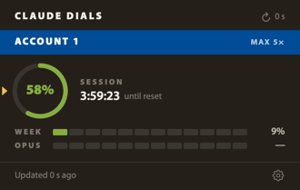
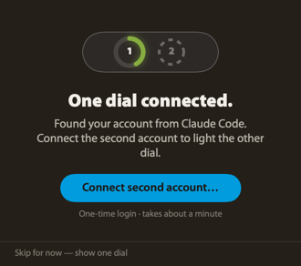
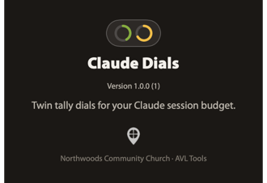

# Claude Dials

A menu-bar tally for your Claude session budget — two accounts as twin ring dials in a black capsule, going green → gold → coral like an on-air light.



## Features

- **Twin-ring capsule in the menu bar** — one ring per Claude account, filled to the 5-hour session usage, colored by the worst of your session / weekly / Opus windows so it never under-reports.
- **Broadcast-style popover** — per-account color-block header, a session ring with a live countdown to reset, and segmented meters for the weekly and Opus limits.
- **Two accounts at once** — monitor a personal and an organization account side by side, each in its own Claude Code profile.
- **Designed degraded states** — stale data dims to last-known; a lost credential goes hollow; an expired token or unreachable endpoint shows a clear warning strip instead of a blank.
- **Zero configuration for account one** — it reads the account you're already logged into in Claude Code.
- **Auto-updates** via Sparkle.

| Onboarding | About |
|---|---|
|  |  |

## Requirements

- macOS 15.0 or later
- Apple Silicon (aarch64)
- [Claude Code](https://claude.com/claude-code) installed and logged in (Claude Dials reads its usage data)

## Installation

1. Download the latest `Claude Dials-vX.Y.Z-aarch64.zip` from [Releases](../../releases).
2. Extract it and move **Claude Dials.app** to your Applications folder.
3. Open it once — macOS will block it (unsigned).
4. Go to **System Settings → Privacy & Security**, scroll down, and click **Open Anyway**.
5. Claude Dials now lives in your menu bar.

On first launch, macOS asks permission for Claude Dials to read Claude Code's
credential from your Keychain — click **Always Allow**.

## Usage / Quick Start

- **Left-click** the capsule to open the popover with full per-account detail.
- **Right-click** for Refresh, Settings, About, Check for Updates, and Quit.
- The dial fills and changes color as you use Claude: **green** under 60 %, **gold** 60–85 %, **coral** above 85 %.

### Adding a second account

A second account needs its own Claude Code profile (Claude Code stores one login
per profile). Click **Connect second account…** in the popover or Settings — it
opens Terminal and logs the second account into a dedicated profile, then lights
the second dial automatically. Pick your *other* account in the browser that opens.

## Configuration

Open **Settings** (right-click → Settings) to rename accounts and set the refresh
interval (default 3 minutes — the usage endpoint is unofficial, so Claude Dials
polls conservatively).

## Building from Source

```bash
# Requires xcodegen (brew install xcodegen) and Xcode 16
git clone https://github.com/NorthwoodsCommunityChurch/claude-dials.git
cd claude-dials

# Brand fonts are not committed (Adobe Myriad Pro). Copy them from the brand repo:
git clone https://github.com/NorthwoodsCommunityChurch/northwoods-brand.git ../northwoods-brand
cp ../northwoods-brand/assets/fonts/MyriadPro-{Regular,Semibold,Black}.otf ClaudeDials/Resources/Fonts/

xcodegen generate
xcodebuild -scheme ClaudeDials -configuration Release build
```

If you skip the font copy the app still builds and runs — it falls back to the
system font, just off-brand.

## Project Structure

```
Claude Dials/
├── ClaudeDials/
│   ├── ClaudeDialsApp.swift        @main, menu-bar-only (LSUIElement)
│   ├── AppDelegate.swift           wires Sparkle + StatusBarController + windows
│   ├── StatusBarController.swift   the capsule status item + popover + context menu
│   ├── CapsuleStatusIcon.swift     custom-drawn twin-ring menu-bar capsule
│   ├── Theme.swift                 brand colors, fonts, spacing
│   ├── Models/                     Account, Usage, ConfigStore
│   ├── Services/                   KeychainReader, UsageClient, UsageMonitor, AccountSetupService
│   ├── Views/                      RingDial, SegmentMeter, popover, onboarding, settings, about
│   └── Resources/Fonts/            bundled Myriad Pro OTFs
├── project.yml                     xcodegen source of truth
├── design/                         DESIGN.md lives in root; HTML mockup in design/sketches/
└── docs/images/                    screenshots
```

## Data Source & Privacy

Claude Dials reads the same data Claude Code's `/usage` command shows: your OAuth
credential from the macOS Keychain and the `GET /api/oauth/usage` endpoint. This
endpoint is **unofficial** and may change without notice — see [CREDITS.md](CREDITS.md).
Your tokens are never stored by this app or sent anywhere except `api.anthropic.com`.

## License

[MIT License](LICENSE) — Copyright (c) 2026 Northwoods Community Church

## Credits

See [CREDITS.md](CREDITS.md).
